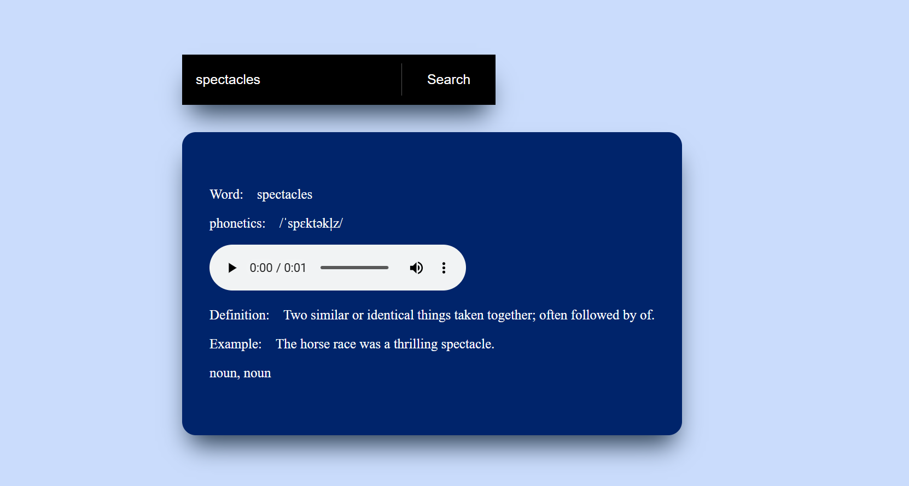

# 📘 Dictionary Web Application

---

### 🌟 Overview  
This is a simple dictionary web application built using **HTML**, **CSS**, and **JavaScript**. It allows users to search for word meanings, pronunciations, and usage examples.

---

### 🚀 Features  
✔️ Search for word meanings  
✔️ Shows pronunciation and phonetics  
✔️ Provides example sentences  
✔️ Audio pronunciation  
✔️ Responsive design for mobile and desktop  
✔️ API-based word search (e.g., [Free Dictionary API](https://dictionaryapi.dev/))

---

### 🛠 Tech Stack  
- **HTML** – Structure  
- **CSS** – Styling  
- **JavaScript** – Functionality  
- **API** – Word data (Free Dictionary API)

---

